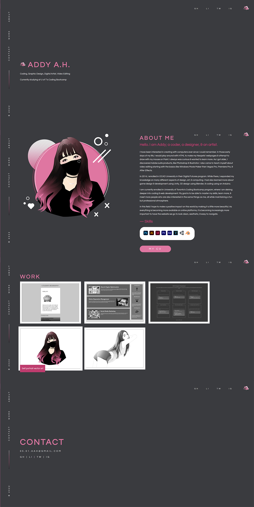

# Module 2 Challenge

## Professional Portfolio

### Description

In this challenge, I have created a professional porfolio that 
showcases my abilities & skills in a clean & aesthetic way 
that suits my visual style. My porfolio includes a intro 
landing page (which says my name & a short summary of who I am),
an About Me section (which tells employers more about me as well
as my skills & includes my CV), a Work section (which includes 
current works of mine), and a Contact section (which states 
my email as well as SNS links). For quick navigation, I have 
added a Navigation bar to jump from each section, my logo at 
the top right to take visitors back to the top, & quick SNS 
links at the top of the page.

### Screenshot 

Here is a preview of how my porfolio looks like. 

Each individual section has been captured separately & combined 
together. The experience feels less claustrophobic when navigating 
than shown in the preview.

### GitHub Repository 

You can view my coding process (however clumsy haha) at the link below.

https://github.com/kirbyfridge/professional-portfolio/

### GitHub Pages 

You can view the functional webpage at the link below.

https://kirbyfridge.github.io/professional-portfolio/
